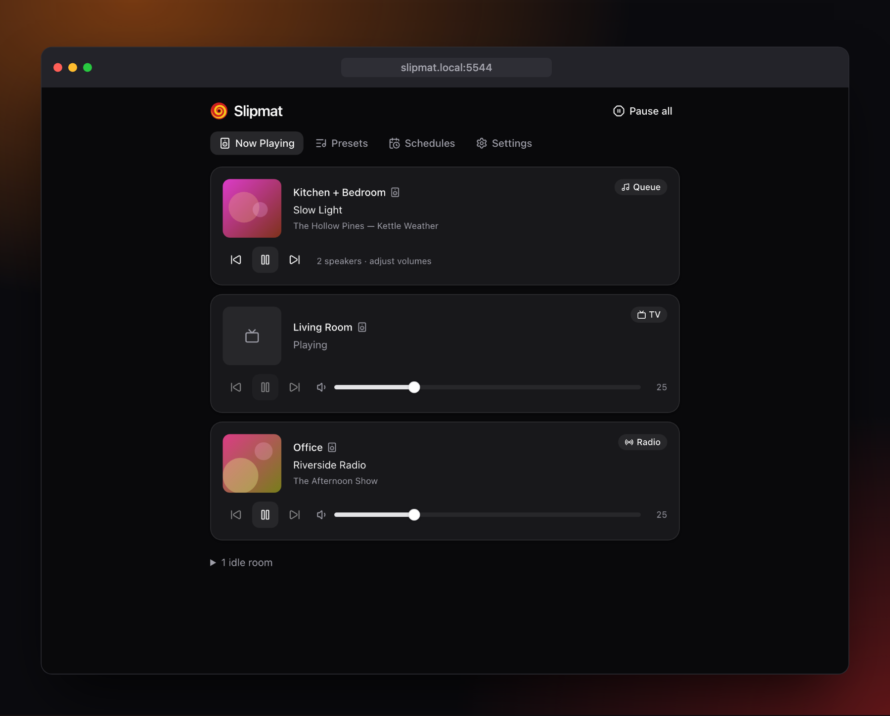
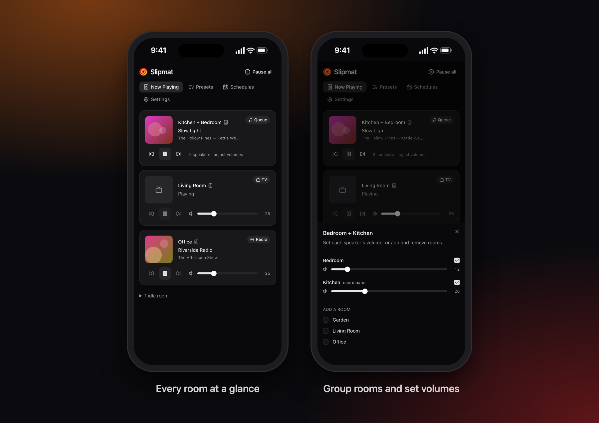
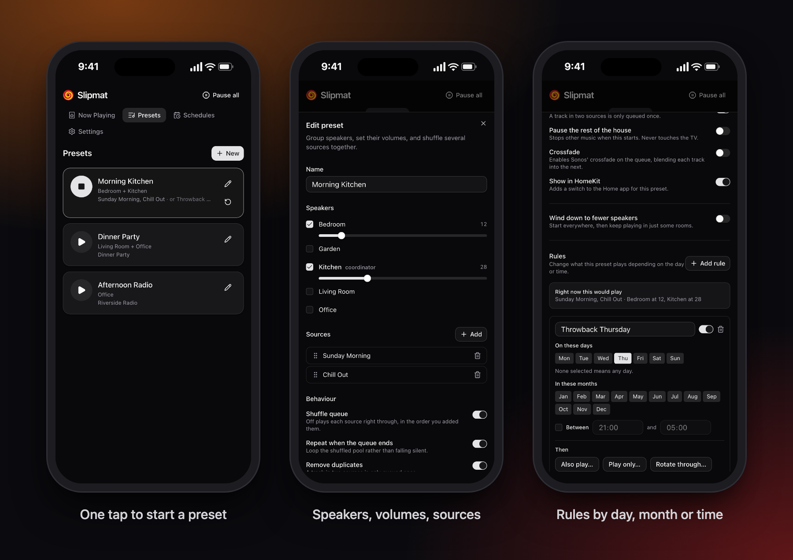
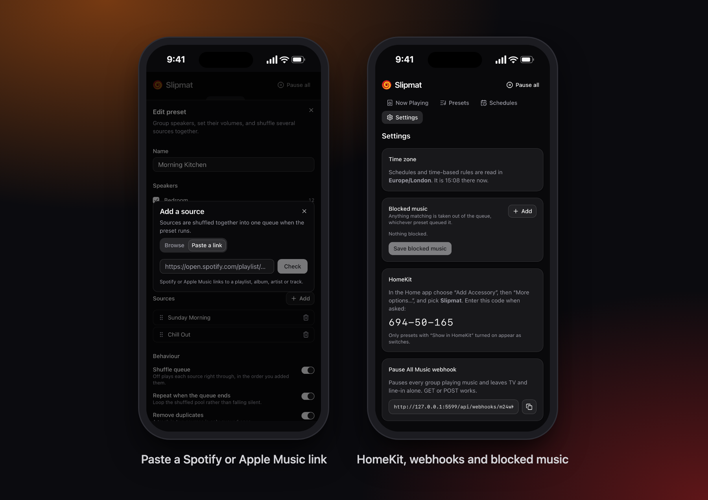

<h1 align="center">
  <br>
  Slipmat
</h1>

<p align="center">
  <strong>Self-hosted control and automation for Sonos.</strong><br>
  One tap to put the right music in the right rooms, at the right volumes.
</p>

<p align="center">
  
</p>

Slipmat runs on your own server and talks to your speakers directly over the local network. There's
no cloud and no Sonos account involved, and nothing leaves the house.

Its heart is **presets**. A preset groups a set of speakers, sets each one's volume, and starts a
queue shuffled together from as many playlists, albums and favourites as you like. Start one from
the web UI, from a webhook (Shortcuts, Stream Deck, Node-RED), on a schedule, or with a HomeKit
switch that also shows whether it's playing.

## Everyday playback



- Every room on one screen, with artwork, transport controls and volume.
- Group and ungroup rooms, and set each speaker's volume within a group.
- **Pause all** stops the music everywhere and leaves TV audio alone.
- Works as well on a phone as on a desktop.

## Presets



- **Speakers and volumes**: pick the rooms, set a volume for each, and choose which one leads.
- **Many sources, one queue**: Sonos playlists, favourites and your music library, shuffled
  together, with duplicates removed.
- **Rules**: change what a preset plays by day, month or time of day. Add Christmas music in
  December, rotate through a different playlist each day, or play quieter after 9pm. The editor
  shows what the preset would play right now.
- **Starts fast**: sound begins within about a second, and the rest of the queue fills in behind it.
- **Wind down**: start in every room, then carry on in just a few.
- Optional crossfade, repeat, and pausing the rest of the house.

## Sources and integrations



- **Paste a link** to a Spotify or Apple Music playlist, album, artist or track.
- **Schedules** start or stop presets at set times, with sleep timers, and can pause music when the
  TV comes on.
- **Webhooks** for every preset and for Pause All, using GET or POST.
- **HomeKit**: an optional built-in bridge, with no Homebridge needed, that shows presets as
  switches in the Home app.
- **Blocked music**: tracks, artists or albums that should never play, whichever preset queued
  them.

## Running it

### Unraid

Install **Slipmat** from Community Applications. Until it's listed there, fetch the template on the
server and pick it from **Docker → Add Container → Template**:

```sh
wget -O /boot/config/plugins/dockerMan/templates-user/my-Slipmat.xml \
  https://raw.githubusercontent.com/alexjsp/unraid-community-apps/main/templates/slipmat.xml
```

### Docker Compose

```sh
curl -O https://raw.githubusercontent.com/alexjsp/slipmat/main/compose.yml
docker compose up -d
```

Settings go in a `.env` beside it; every one is optional.

### Docker

```sh
docker run -d --name slipmat \
  --network host \
  -v /path/to/appdata/slipmat:/data \
  ghcr.io/alexjsp/slipmat:latest
```

Then open `http://<host>:5544`.

### `--network host` is required

Not a convenience — three things depend on it:

- **SSDP discovery** is multicast and doesn't cross a Docker bridge network.
- **UPnP events**: the speakers dial *back into* Slipmat's callback URL, so they need a routable
  address for it.
- **HomeKit** (if enabled) advertises over mDNS.

If discovery still can't get through, set `SLIPMAT_SEED_IP` to any one speaker's IP address —
Slipmat finds the rest of the household from there.

Docker Desktop on macOS has no real host networking. Develop natively with `just dev` instead.

### Configuration

See [`.env.example`](.env.example) for the full list. The ones that matter:

| Variable | Default | Notes |
| --- | --- | --- |
| `SLIPMAT_PASSWORD` | — | **Optional.** Setting it turns authentication on; unset means no login. |
| `SLIPMAT_SESSION_SECRET` | generated | Signs login sessions. Generated and stored on first run if unset. |
| `SLIPMAT_PORT` | `5544` | |
| `SLIPMAT_SEED_IP` | — | Discovery fallback. |
| `SLIPMAT_HOMEKIT` | `0` | Set to `1` to enable the embedded HomeKit bridge. |
| `SLIPMAT_HOMEKIT_PIN` | generated | Pairing code. Generated on first run if unset, and shown in Settings. |
| `PUID` / `PGID` | `10001` | User and group the server runs as. `/data` is handed to them on start. |

### Authentication is optional

Slipmat runs without a login by default, and that's deliberate rather than an oversight: Sonos has
no authentication of its own, so anything already on your network can control the speakers. Putting
a password in front of Slipmat wouldn't change that.

Set `SLIPMAT_PASSWORD` to turn it on. Worth doing if you expose Slipmat beyond the LAN, or if not
everyone in the house should be able to edit presets.

Two protections apply either way:

- **Webhook URLs always carry a per-preset secret token** rather than relying on a session, so they
  work from Shortcuts, Node-RED and the like. Regenerate a token from the preset editor if one leaks.
- **A host-header allowlist** blocks DNS rebinding, which is the one thing a browser on your network
  can do to an open LAN service.

## Development

`SLIPMAT_FAKE_SONOS=1` runs against an invented household instead of real speakers. It's what the
screenshots above were taken from: `just readme-images` regenerates them.

Requires Node 24+, [pnpm](https://pnpm.io) and [just](https://github.com/casey/just).

```sh
just install
just dev        # API on :5544, UI on :5545 with a proxy to the API
just check      # lint, typecheck, test
```

> ⚠️ **Tests never touch real speakers.** They run against the fake Sonos layer. Anything that
> would mutate real hardware needs an explicit ask first — see [`CLAUDE.md`](CLAUDE.md).

Personal recipes, such as a deploy to your own server, can go in a gitignored
`local/local.just`; the justfile imports it when it exists.

## Prior art

[`jishi/node-sonos-http-api`](https://github.com/jishi/node-sonos-http-api) pioneered this shape and
its preset semantics were a useful reference. Slipmat is built on
[`@svrooij/sonos`](https://github.com/svrooij/node-sonos-ts) instead — actively maintained, fully
typed, with the event subscriptions the preset state tracking needs.

## License

[MIT](LICENSE)
